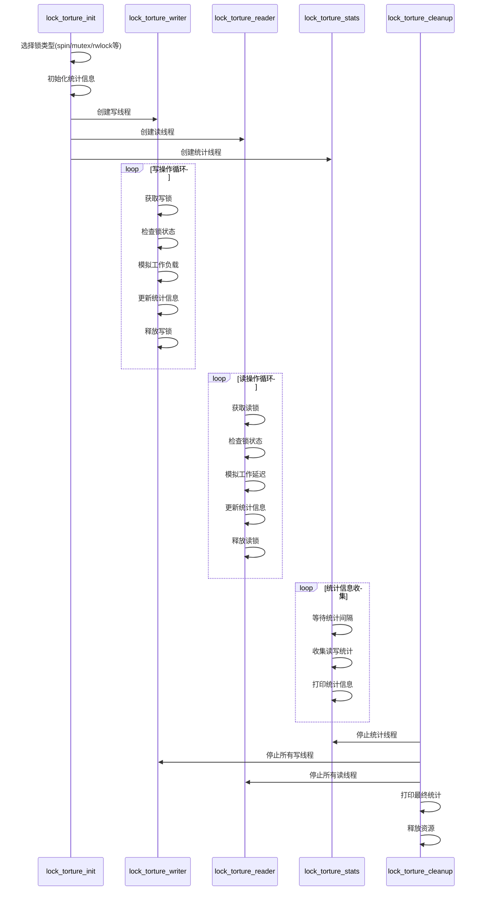

> https://www.kernel.org/doc/html/latest/locking/locktorture.html
>

## 内核锁压力测试操作

### CONFIG_LOCK_TORTURE_TEST

`CONFIG_LOCK_TORTURE_TEST` 配置选项提供了一个内核模块（`locktorture`），用于对内核核心锁原语进行压力测试。如果需要，可以在正在运行的内核上动态构建该模块。测试会定期通过 `printk()` 输出状态信息，可通过 `dmesg` 命令（可能需要用 `grep` 过滤“torture”关键词）查看。**测试在模块加载时启动，卸载时停止**。该程序基于 RCU 压力测试工具 `rcutorture` 的设计思路。

压力测试通过创建多个内核线程实现：这些线程会获取锁并持有特定时间，以模拟不同临界区的行为。锁的竞争程度可通过延长临界区持有时间和/或创建更多内核线程来调节。

## 测试方式

- 创建多个写线程和读线程并发访问锁
- 线程会反复获取和释放锁
- 记录锁的获取次数、失败次数等统计信息
- 可以配置测试持续时间、线程数量等参数

### 模块参数

#### 锁压力测试专属参数

- **nwriters_stress**
  对独占锁所有权（写者）进行压力测试的内核线程数。默认值为在线 CPU 数量的两倍。

- **nreaders_stress**
  对共享锁所有权（读者）进行压力测试的内核线程数。默认值与写者线程数相同。若用户未指定 `nwriters_stress`，则读者和写者线程数均等于在线 CPU 数量。

- **torture_type**
  待测试的锁类型。默认仅测试自旋锁。支持以下锁类型（字符串值）：
  - **“lock_busted”**：模拟有缺陷的锁实现。
  - **“spin_lock”**：`spin_lock()` 和 `spin_unlock()` 对。
  - **“spin_lock_irq”**：`spin_lock_irq()` 和 `spin_unlock_irq()` 对。
  - **“rw_lock”**：读写锁 `lock()` 和 `unlock()` 对。
  - **“rw_lock_irq”**：读写锁 `lock_irq()` 和 `unlock_irq()` 对。
  - **“mutex_lock”**：`mutex_lock()` 和 `mutex_unlock()` 对。
  - **“rtmutex_lock”**：`rtmutex_lock()` 和 `rtmutex_unlock()` 对（内核需启用 `CONFIG_RT_MUTEXES=y`）。
  - **“rwsem_lock”**：读写信号量 `down()` 和 `up()` 对。

#### 压力测试框架参数（RCU + 锁）

- **shutdown_secs**
  测试运行的秒数，超时后终止测试并关闭系统（关机）。默认值为 0（禁用测试终止和系统关闭，适用于自动化测试）。

- **onoff_interval**
  每次随机执行 CPU 热插拔操作的间隔秒数。默认值为 0（禁用 CPU 热插拔）。若内核未启用 `CONFIG_HOTPLUG_CPU`，无论该参数如何设置，`locktorture` 均不会执行 CPU 热插拔操作。

- **onoff_holdoff**
  延迟启动 CPU 热插拔操作的秒数。通常仅在内核内置 `locktorture` 并在启动时自动运行时使用，避免 CPU 热插拔干扰启动代码。该参数仅在启用 `CONFIG_HOTPLUG_CPU` 时有效。

- **stat_interval**
  统计信息通过 `printk()` 输出的间隔秒数。默认每 60 秒输出一次统计信息。若设置为 0，仅在模块卸载时输出统计信息。

- **stutter**
  测试运行一段时间后暂停相同时长的周期秒数。默认值为 5（即运行和暂停各约 5 秒）。设置为 0 时，测试持续运行不暂停。

- **shuffle_interval**
  测试线程固定绑定到特定 CPU 子集的时长（秒），默认 3 秒，需与 `test_no_idle_hz` 配合使用。

- **verbose**
  启用详细调试日志（通过 `printk()` 输出），默认启用。额外信息主要涉及高层错误和主“torture”框架的报告。

### 统计信息

统计信息格式如下：
```  
spin_lock-torture: Writes:  Total: 93746064  Max/Min: 0/0   Fail: 0  
   (A)                    (B)            (C)            (D)          (E)  
```  
- **(A)**：正在测试的锁类型（`torture_type` 参数值）。
- **(B)**：写锁获取次数。若为读写锁原语，会额外输出“Reads”读锁统计信息。
- **(C)**：锁获取总次数。
- **(D)**：线程获取锁失败次数的最小值和最大值。
- **(E)**：锁获取是否出错（布尔值）。仅当锁原语实现存在缺陷时为真，否则锁获取应始终成功（如 `spin_lock()`）。“lock_busted”类型是例外示例。

### 用法

可使用以下脚本进行锁压力测试：
```sh  
#!/bin/sh  
modprobe locktorture   # 加载模块，启动测试  
sleep 3600              # 运行 1 小时  
rmmod locktorture       # 卸载模块，停止测试  
dmesg | grep torture:   # 过滤并查看测试日志  
```  

输出可手动检查是否包含“!!!”错误标志。也可编写更复杂的脚本自动检测错误。`rmmod` 命令会强制通过 `printk()` 输出“SUCCESS”（成功）、“FAILURE”（失败）或“RCU_HOTPLUG”（检测到 CPU 热插拔问题，无锁相关失败）。

### 示例

运行以下测试命令：
```bash
insmod locktorture.ko torture_type=spin_lock nwriters_stress=4 stat_interval=10 ;sleep 60 ;rmmod locktorture.ko
```

典型的测试输出会类似这样：
```bash
[ 6369.927569] spin_lock-torture:--- Start of test [debug]: nwriters_stress=4 nreaders_stress=0 nested_locks=0 stat_interval=10 verbose=1 shuffle_interval=3 stutter=5 shutdown_secs=0 onoff_interval=0 onoff_holdoff=0
[ 6380.000533] Writes:  Total: 2667137  Max/Min: 683667/646954   Fail: 0 
[ 6390.238994] Writes:  Total: 5491625  Max/Min: 1431577/1338410   Fail: 0 
[ 6400.479992] Writes:  Total: 8284652  Max/Min: 2119818/2033303   Fail: 0 
[ 6410.723182] Writes:  Total: 11296889  Max/Min: 2877750/2765512   Fail: 0 
[ 6420.961325] Writes:  Total: 14076689  Max/Min: 3556193/3475005   Fail: 0 
[ 6430.111216] Writes:  Total: 16516172  Max/Min: 4172572/4075933   Fail: 0 
[ 6430.111487] Writes:  Total: 16516172  Max/Min: 4172572/4075933   Fail: 0
[ 6430.111514] spin_lock-torture:--- End of test: SUCCESS [debug]: nwriters_stress=4 nreaders_stress=0 nested_locks=0 stat_interval=10 verbose=1 shuffle_interval=3 stutter=5 shutdown_secs=0 onoff_interval=0 onoff_holdoff=0
```

让我解读这些输出信息：

1. 测试配置信息
  - torture_type=spin_lock: 测试自旋锁
  - nwriters_stress=4: 4个写线程
  - stat_interval=10: 每10秒打印一次统计信息

2. 统计数据解读
  - Total: 所有线程累计获得锁的总次数
  - Max/Min: 单个线程获得锁的最大/最小次数
  - Fail: 锁操作失败的次数

3. 重要指标分析
  - 如果 Fail=0，说明锁操作正常，没有发生错误
  - Max/Min 比值接近1，说明负载均衡良好
  - 如果出现 ??? 标记，表示线程间性能差异过大
  - 如果出现 !!! 标记，表示检测到锁的错误使用

4. 潜在问题指示
  - 如果看到 Fail 不为0，需要排查锁实现
  - 如果 Max/Min 差异过大，可能存在调度不公平
  - 如果总操作数增长变慢，可能存在性能瓶颈

通过这些输出，我们可以：
- 评估锁的正确性
- 检查负载均衡情况
- 发现潜在的性能问题
- 对比不同锁实现的性能

## 实现分析

下面分析这个锁性能测试模块的代码结构和主要实现逻辑：

### 代码结构

1. **核心数据结构**
```c
/* 
 * 锁性能测试的操作函数集合,支持不同类型的锁实现
 */
struct lock_torture_ops {
    void (*init)(void);        /* 锁初始化函数 */
    void (*exit)(void);        /* 锁清理函数 */
    int (*writelock)(int tid); /* 获取写锁函数 */
    void (*write_delay)(struct torture_random_state *trsp); /* 写锁延迟处理 */
    void (*task_boost)(struct torture_random_state *trsp);  /* 任务优先级提升 */
    void (*writeunlock)(int tid); /* 释放写锁函数 */
    int (*readlock)(int tid);     /* 获取读锁函数 */  
    void (*read_delay)(struct torture_random_state *trsp);  /* 读锁延迟处理 */
    void (*readunlock)(int tid);  /* 释放读锁函数 */
    
    unsigned long flags;       /* 中断标志(用于irq自旋锁) */
    const char *name;         /* 锁类型名称 */
};

/*
 * 每个线程的锁操作统计信息
 */
struct lock_stress_stats {
    long n_lock_fail;         /* 获取锁失败次数 */
    long n_lock_acquired;     /* 成功获取锁次数 */
}; 

/*
 * 锁测试的全局上下文信息
 */
struct lock_torture_cxt {
    int nrealwriters_stress;  /* 实际写线程数 */
    int nrealreaders_stress;  /* 实际读线程数 */
    bool debug_lock;          /* 是否启用锁调试 */
    bool init_called;         /* 是否已调用init函数 */
    atomic_t n_lock_torture_errors;  /* 错误计数器 */
    struct lock_torture_ops *cur_ops;  /* 当前使用的锁操作集 */
    struct lock_stress_stats *lwsa;    /* 写线程统计数组 */
    struct lock_stress_stats *lrsa;    /* 读线程统计数组 */
};
```

2. **支持的锁类型**
- spin_lock (自旋锁)
- spin_lock_irq (带中断禁止的自旋锁)
- mutex (互斥锁)
- rwsem (读写信号量)
- rtmutex (实时互斥锁)
- percpu_rwsem (per-CPU读写信号量)

3. **主要组件**
- `lock_torture_writer()`: 写者线程
- `lock_torture_reader()`: 读者线程
- `lock_torture_stats()`: 统计信息收集线程
- `lock_torture_init()`: 模块初始化
- `lock_torture_cleanup()`: 模块清理

### 主要实现逻辑

1. **初始化流程**
```c
static int __init lock_torture_init(void)
{
    // 1. 参数校验
    // 2. 选择锁类型
    // 3. 初始化统计信息
    // 4. 创建测试线程
    // 5. 启动统计收集
}
```

2. **测试线程工作流程**
```c
static int lock_torture_writer(void *arg) {
    do {
        // 1. 获取锁
        // 2. 检查锁状态
        // 3. 模拟工作负载
        // 4. 释放锁
        // 5. 更新统计信息
    } while (!torture_must_stop());
}
```

3. **统计信息收集**
```c
static int lock_torture_stats(void *arg) {
    do {
        // 每 stat_interval 秒
        // 1. 收集各线程统计
        // 2. 打印统计信息
        // 3. 检查错误状态
    } while (!torture_must_stop());
}
```

4. **清理流程**
```c
static void lock_torture_cleanup(void)
{
    // 1. 停止所有测试线程
    // 2. 打印最终统计信息
    // 3. 释放资源
    // 4. 输出测试结果
}
```



### 关键特性

1. **可配置项**
- 锁类型 (torture_type)
- 读写线程数量
- 统计间隔
- 运行时间
- 随机延迟参数

2. **测试指标**
- 锁获取次数
- 锁操作失败次数
- 线程间负载均衡性
- 读写冲突检测

3. **安全保护**
- 死锁检测
- 并发访问检查
- 资源泄漏防护
- 错误状态监控

这是一个设计完善的锁性能测试框架,可以有效地测试和验证各种锁机制的正确性和性能特征。

我来说明运行锁性能测试时的环境配置要求和注意事项:

## 测试环境

### 对已运行服务的影响

1. 性能影响:
- CPU使用率会显著提高
- 系统响应可能变慢
- 内存压力会增加
- 进程调度延迟可能增加

1. 稳定性影响:
- 可能影响实时性要求高的服务
- 锁竞争会影响其他服务的性能
- 系统负载会明显上升

### 建议的运行环境

1. 测试环境准备:
```bash
# 停止非必要服务
systemctl stop <non-critical-services>

# 调整系统限制
echo -1 > /proc/sys/kernel/sched_rt_runtime_us  # 允许RT任务充分运行
```

2. 运行时建议:
- 在非生产环境运行
- 选择系统负载低的时间段
- 避免与关键业务同时运行
- 设置合理的测试时长(shutdown_secs)

这个测试主要用于内核开发和调试环境,**不建议在生产系统上运行**。如果必须在生产系统测试,建议在业务低峰期进行,并做好监控和应急预案。

### 测试自定义锁的步骤

1. **添加自定义锁的操作集**
```c
// 定义自定义锁的操作函数
static struct lock_torture_ops custom_lock_ops = {
    .writelock = custom_lock_write_lock,
    .write_delay = torture_spin_lock_write_delay,  // 可以复用已有延迟函数
    .writeunlock = custom_lock_write_unlock,
    .readlock = custom_lock_read_lock,     // 如果支持读写锁
    .readunlock = custom_lock_read_unlock, // 如果支持读写锁
    .name = "custom_lock"
};
```

2. **注册自定义锁**
```c
static struct lock_torture_ops *torture_ops[] = {
    &custom_lock_ops,  // 添加自定义锁
    &spin_lock_ops,    // 现有的锁类型
    &mutex_lock_ops,
    // ...
};
```

### 性能对比测试

1. **基准测试**
```bash
# 测试原始锁
insmod locktorture.ko \
    torture_type=spin_lock \
    nwriters_stress=8 \
    stat_interval=10 \
    shutdown_secs=300
```

2. **优化锁测试**
```bash
# 测试优化后的锁
insmod locktorture.ko \
    torture_type=custom_lock \
    nwriters_stress=8 \
    stat_interval=10 \
    shutdown_secs=300
```

3. **关键性能指标对比**
- 总获取锁次数(Total)
- 最大/最小获取比(Max/Min)
- 失败次数(Fail)
- 延迟分布

### 测试场景建议

1. **不同负载测试**
```bash
# 轻负载
nwriters_stress=2 nreaders_stress=2

# 重负载 
nwriters_stress=16 nreaders_stress=16

# 读写比例失衡
nwriters_stress=2 nreaders_stress=14
```

2. **压力测试**
```bash
# 长时间运行
shutdown_secs=3600

# 高频统计
stat_interval=1
```

3. **特定场景模拟**
```bash
# 添加CPU迁移压力
shuffle_interval=1

# 模拟系统抖动
stutter=5
```

### 结果分析示例

```text
原始锁:
[12345.678] Writes: Total: 1000000 Max/Min: 110000/90000 Fail: 0

优化锁:
[12345.678] Writes: Total: 1500000 Max/Min: 160000/140000 Fail: 0
```

分析:
1. 总吞吐量提升了50%
2. 线程间负载更均衡(Max/Min比例更小)
3. 稳定性保持不变(Fail=0)

这个测试框架可以帮助你:
- 量化锁优化的效果
- 验证锁的正确性
- 发现性能瓶颈
- 对比不同实现方案
